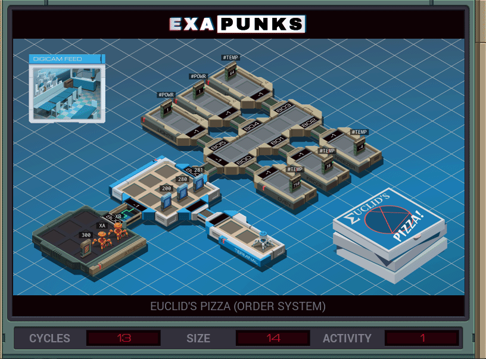

# Speed


<details><summary></summary>
<p>
XA 

```
GRAB 300

@REP 5
COPY F M
@END
```

XB

```
LINK 800
GRAB 200
SEEK 9999

@REP 5
COPY M F
@END
```
</p>
</details>

# Size


<details><summary></summary>
<p>
XA 

```
GRAB 300

MARK READ
COPY F M
JUMP READ
```

XB

```
LINK 800
GRAB 200
SEEK 9999

@REP 5
COPY M F
@END
```
</p>
</details>
