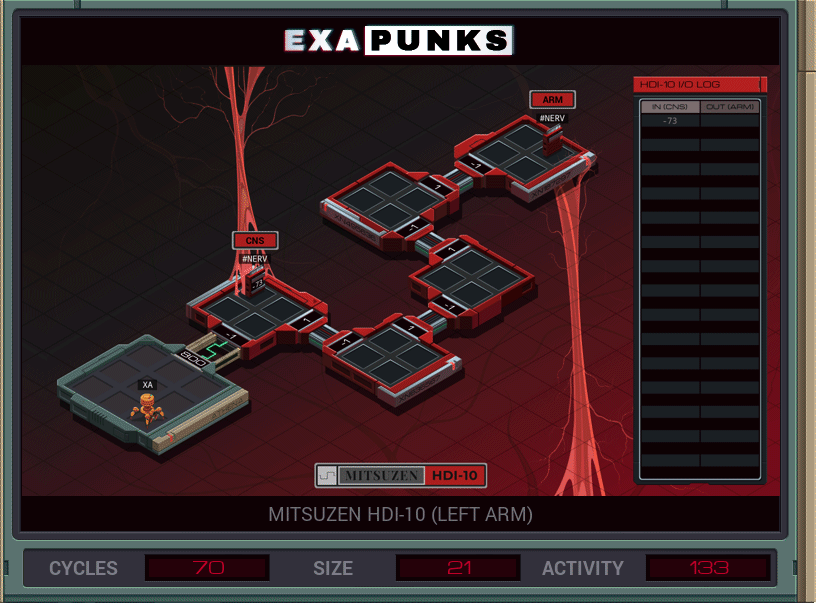

# Default


<details><summary>CODE</summary>
<p>

```
LINK 800

MARK A
COPY #NERV X

REPL A

@REP 4
LINK 1
@END
TEST X > 50
TJMP CLAMPOVER
TEST X < -120
TJMP CLAMPUNDER
COPY X #NERV
HALT


MARK CLAMPOVER
@REP 2
NOOP
@END
COPY 50 #NERV
HALT


MARK CLAMPUNDER
COPY -120 #NERV
```
</p>
</details>
