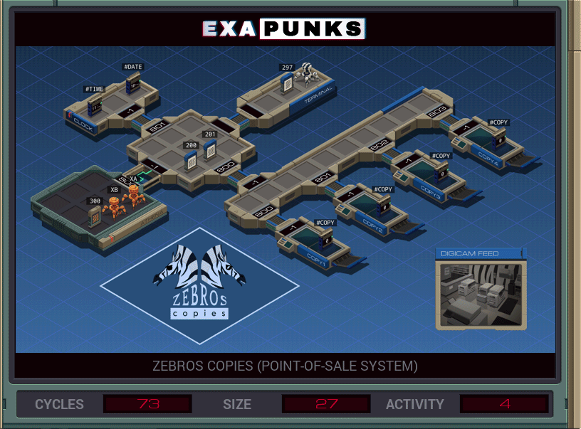

# Default


<details><summary></summary>
<p>
XA

```
LINK 800
LINK 801
COPY #DATE M
LINK -1
GRAB 201
SEEK 9999

COPY M F
COPY M F
```

XB
```
GRAB 300
COPY F X
DROP
LINK 800
GRAB 201
SEEK 9999
COPY M F
COPY X F
DROP


GRAB 200

MARK SCAN
TEST X = F
TJMP WRITE
SEEK 2
JUMP SCAN

MARK WRITE
COPY F M
COPY F M
SEEK -2
COPY 0 F 
COPY 0 F
```
</p>
</details>
