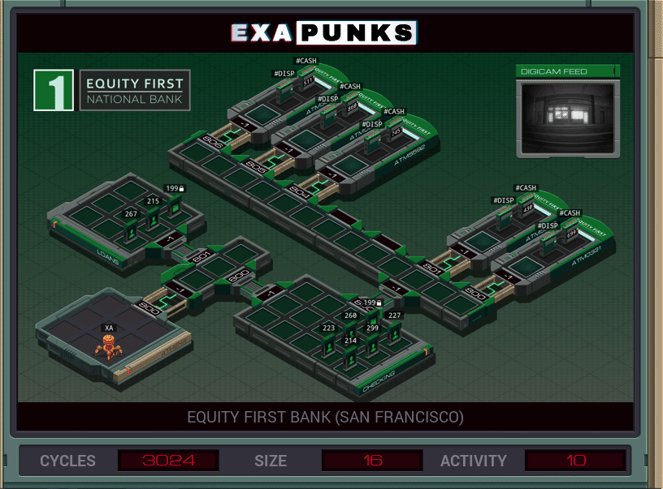
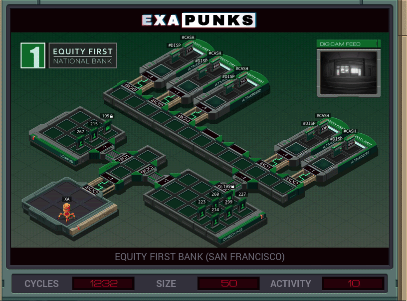

# Default


<details><summary>CODE</summary>
<p>

```
COPY 800 X

@REP 3
LINK X
@END

MARK FORK
REPL CLONE
ADDI X 1 X
TEST X > 806
FJMP FORK
HALT


MARK CLONE
LINK X

MARK SPEW
COPY 20 #DISP
TEST #CASH > 0
TJMP SPEW
```
</p>
</details>

# Speed


<details><summary>CODE</summary>
<p>

```
COPY 800 X

@REP 3
LINK X
@END

MARK FORK
REPL CLONE
ADDI X 1 X
TEST X > 806
FJMP FORK
HALT


MARK CLONE
LINK X

MARK SPEW
COPY 20 #DISP

TEST #CASH > 30
TJMP TEN
TEST #CASH > 0

TJMP SPEW
HALT


MARK TEN
@REP 29
COPY 20 #DISP
@END

JUMP SPEW
```
</p>
</details>
