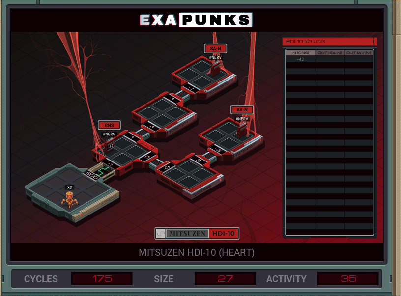

# Fork


<details><summary>CODE</summary>
<p>

```
LINK 800

MARK START
NOTE IN CNS

COPY #NERV X
REPL SAN
REPL AVN
COPY M T
REPL START
HALT

MARK SAN
@REP 2
LINK 1
@END
NOTE IN SAN

COPY 40 #NERV
ADDI X 10 X

MARK SANBEAT
COPY -70 #NERV
ADDI X 10 X
TEST X < -9
TJMP SANBEAT

HALT

MARK AVN
@REP 2
LINK 3
@END

NOTE IN AVN
COPY -70 #NERV
COPY 40 #NERV
ADDI X 20 X

MARK AVNBEAT
COPY -70 #NERV
ADDI X 10 X
TEST X < -9
TJMP AVNBEAT

COPY 2 M

HALT
```
</p>
</details>

# Fork (small)



<details><summary>CODE</summary>
<p>

```
LINK 800
COPY 1 T
MARK START

NOTE IN CNS
COPY #NERV X
REPL FORK
COPY 3 T
REPL FORK
COPY M T
REPL START
HALT

MARK FORK
@REP 2
LINK T
@END

TEST T = 1
TJMP SANONLY

NOTE IN AVN
COPY -70 #NERV
ADDI X 10 X

MARK SANONLY
COPY 40 #NERV
ADDI X 10 X


MARK BEAT
COPY -70 #NERV
ADDI X 10 X
TEST X < -9
TJMP BEAT

LINK -3
COPY 1 M
```
</p>
</details>
