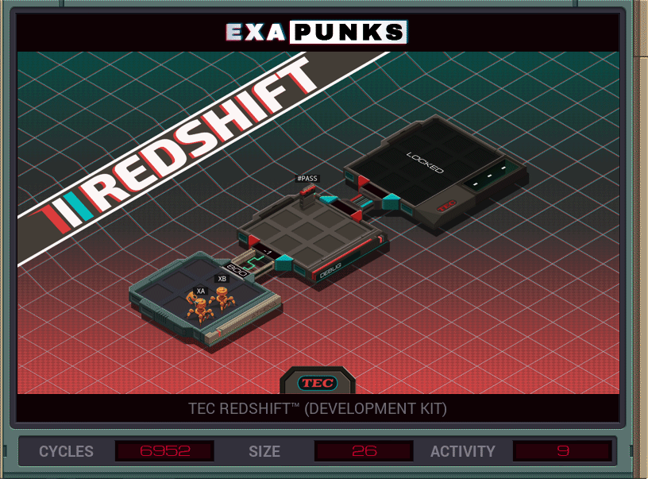

# Default


<details><summary></summary>
<p>
XA

```
NOTE CHECKER
LINK 800

NOTE WAIT SIGNAL
MARK LOOP
COPY M X
NOTE MAKE REPLACEMENT
REPL LOOP

NOTE CHECKER
LINK 800
GRAB 199
COPY F T
DROP

MAKE
SWIZ X 3 F
SWIZ X 2 F
SWIZ X 1 F
COPY T F

KILL
LINK -1
KILL
KILL
LINK -1
```

XB

```
NOTE PW_BRUTEFORCE
LINK 800

MARK LOOP
SWIZ X 3 #PASS
SWIZ X 2 #PASS
SWIZ X 1 #PASS

NOTE PW_ENTERED_SIGNAL
COPY X M

ADDI X 1 X
JUMP LOOP
```

</p>
</details>
