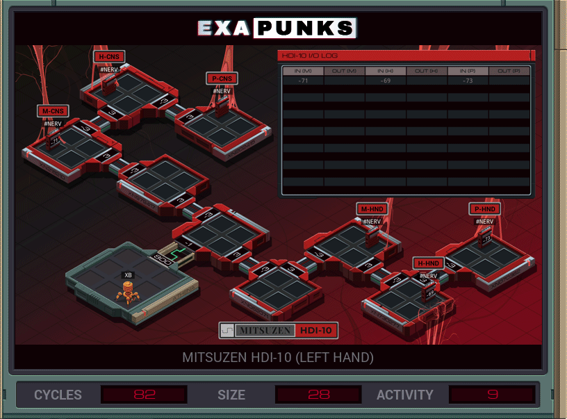

# Synced signal relays


<details><summary></summary>
<p>

XA

```
LINK 800
COPY 3 X
REPL REVERSE
JUMP START

MARK REVERSE
MULI X -1 X
MARK START
LINK X
LINK X

NOTE DETERMINE SIDE
TEST X > 0
REPL CLONE

NOTE SYNC
@REP 2
NOOP
@END

MARK LOOP
TJMP WRITE
COPY #NERV M
NOOP
JUMP LOOP
MARK WRITE
COPY M #NERV
NOOP
NOOP
JUMP LOOP

MARK CLONE
LINK X
REPL CLONE
NOTE FLIP T
TEST T = 0
JUMP LOOP
```

</p>
</details>
