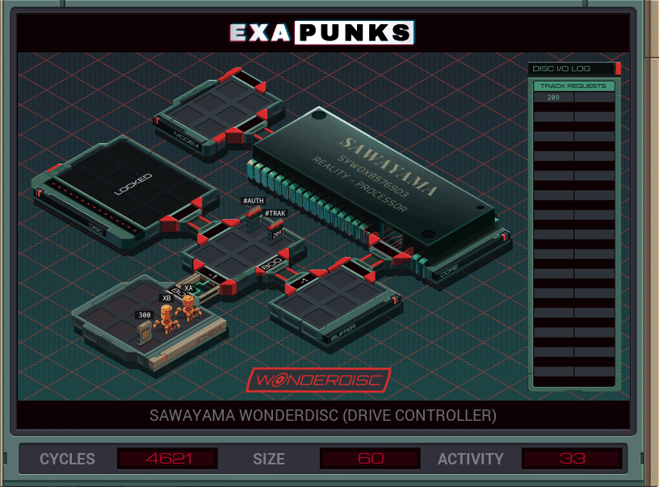

# Solo size


<details><summary></summary>
<p>

XA

```
GRAB 300
LINK 800

REPL UNLOCKER
COPY 803 M
COPY 271 M
COPY 049 M
COPY 512 M
COPY 526 M

DROP
NOOP
NOTE KILL UNLOCKER
KILL

MARK UNLOCKED
REPL WRITER

NOTE MARK READER
COPY #TRAK X

LINK 801
GRAB X

MARK READ
COPY F X
COPY X M
COPY X M
TEST EOF
FJMP READ

DROP
LINK -1
JUMP UNLOCKED


MARK WRITER
GRAB 300
COPY F X
DROP

LINK 800
NOTE DROP LAST FILE
KILL
MAKE

MARK WRITE
NOTE IF SYMBOL?
TEST M > -9999
FJMP ELSE
COPY M F
JUMP WRITE
MARK ELSE
COPY X F
COPY M T
JUMP WRITE

MARK UNLOCKER
COPY M X
@REP 3
SWIZ X @{3,-1} #AUTH
@END
JUMP UNLOCKER
```

</p>
</details>

# speed


<details><summary></summary>
<p>

XA

```
GRAB 300
COPY F X
WIPE

LINK 800

MARK MAIN
COPY #TRAK M
MAKE

COPY M T
MARK LOOP
COPY T F
COPY M T
TJMP LOOP

FILE T
DROP
REPL SCRUBBER

@REP 10
NOOP
@END

REPL MAIN

MARK SCRUBBER
GRAB T
LINK 800
MARK SCAN
TEST F > -9999
TJMP SCAN
SEEK -1
COPY X F
JUMP SCAN
```

XB

```
LINK 800
COPY 8 #AUTH
COPY 0 #AUTH
COPY 3 #AUTH
COPY 2 #AUTH
COPY 7 #AUTH
COPY 1 #AUTH
COPY 0 #AUTH
COPY 4 #AUTH
COPY 9 #AUTH
COPY 5 #AUTH
COPY 1 #AUTH
COPY 2 #AUTH
COPY 5 #AUTH
COPY 2 #AUTH
COPY 6 #AUTH

NOTE UNLOCKED
LINK 801

MARK READER
GRAB M

MARK READ
COPY F M
TEST EOF
FJMP READ
COPY 0 M

REPL READER
```

</p>
</details>
