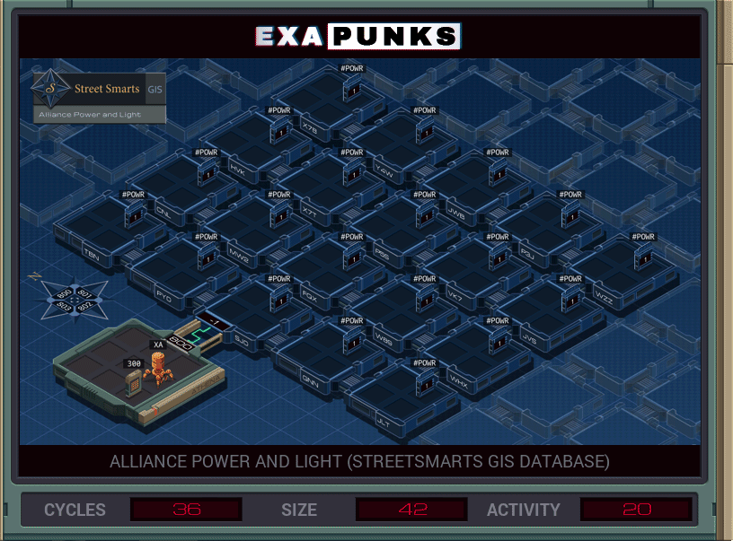

# Lazy


<details><summary></summary>
<p>

XA

```
MARK START

GRAB 300
LINK 800

COPY F X
COPY F T


MARK NEST
REPL EAST
REPL NORTH
REPL SOUTH

JUMP ROOM


MARK EAST
LINK 801
REPL NEST
JUMP ROOM

MARK NORTH
LINK 800
REPL NORTH
JUMP ROOM

MARK SOUTH
LINK 802
REPL SOUTH
JUMP ROOM


MARK POWEROFF
COPY 0 #POWR
JUMP END


MARK CHECKER
HOST X
TEST M = X
TJMP POWEROFF
TEST M = X
TJMP POWEROFF
JUMP END


MARK ROOM
@REP 3
NOOP
@END
MODE
REPL CHECKER
COPY X M
COPY T M


MARK END
WIPE
```

</p>
</details>
