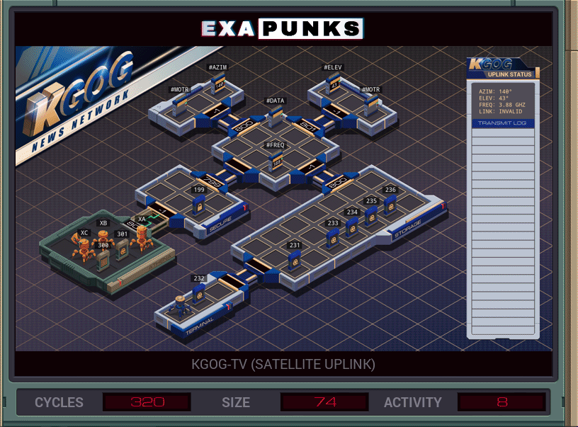

# Default


<details><summary></summary>
<p>

XA

```
GRAB 300
LINK 800
LINK 799

SEEK 1
COPY F X
REPL AZIM

SEEK 1
COPY F X
REPL ELEV

SEEK 1
COPY F #FREQ


WIPE
HALT

MARK ELEV
LINK 801

MARK ELEVALIGN
TEST X = #ELEV
TJMP ELEVALIGNEND

TEST X < #ELEV
FJMP ELEVALIGNLOW

NOTE MARK ELEVALIGNHIGH
COPY -1 #MOTR
JUMP ELEVALIGN

MARK ELEVALIGNLOW
COPY 1 #MOTR

JUMP ELEVALIGN
MARK ELEVALIGNEND
HALT


MARK AZIM
LINK 800

MARK AZIMALIGN
TEST X = #AZIM
TJMP AZIMALIGNEND

TEST X < #AZIM
FJMP AZIMALIGNLOW

NOTE MARK AZIMALIGNHIGH
COPY -1 #MOTR
JUMP AZIMALIGN

MARK AZIMALIGNLOW
COPY 1 #MOTR

JUMP AZIMALIGN
MARK AZIMALIGNEND
HALT
```

XB

```
NOTE ENCRYPTOR
GRAB 301
SEEK 1

LINK 800

NOTE START: -9999
NOTE ADD DATA
NOTE ADD ENC
NOTE IF > -1: SEND-1
NOTE ELSE: ADD 9999
MARK ENCRYPT
ADDI -9999 F X
ADDI X M X

NOTE FASTER THAN ALIGN
NOOP

SEEK -1
TEST X > 0
FJMP ADDNINES
SUBI X 1 F
JUMP SAVED
MARK ADDNINES
ADDI X 9999 F
MARK SAVED

TEST EOF
FJMP ENCRYPT

NOTE END OF DATA
KILL
SEEK -9999
LINK 799

MARK WRITE
COPY F #DATA
TEST EOF
FJMP WRITE
WIPE
```

XC

```
NOTE PRIVKEY
LINK 800
GRAB 199

MARK READ
COPY F M
TEST EOF
FJMP READ
SEEK -9999
JUMP READ
```

</p>
</details>
