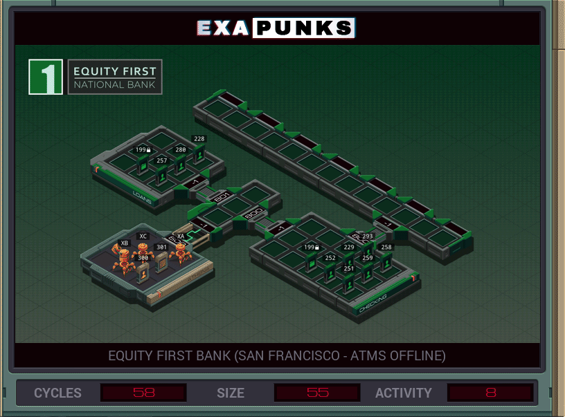

# Default


<details><summary></summary>
<p>

XA

```
GRAB 301
NOTE X = CREDIT
COPY F X
DROP
GRAB 300

LINK 800
LINK 800

SEEK 9999


MARK WRITE
COPY M F
COPY X F
COPY 1 F
COPY 0 F
JUMP WRITE
```

XB

```
GRAB 300
COPY F X
DROP
LINK 800
LINK 800


GRAB 199

MARK READ
COPY F T
NOOP
REPL FETCHER
TEST EOF
FJMP READ
COPY 300 F
DROP
@REP 5
NOOP
@END
KILL
LINK -1
LINK -1
KILL
HALT


MARK FETCHER
GRAB T

COPY F M
SEEK 9999
MODE
COPY X F
COPY M F
COPY 1 F
COPY 0 F
```

XC

```
@REP 3
NOOP
@END
GRAB 301
SEEK 1
COPY F X

MARK PARROT
COPY X M
JUMP PARROT
```

</p>
</details>
