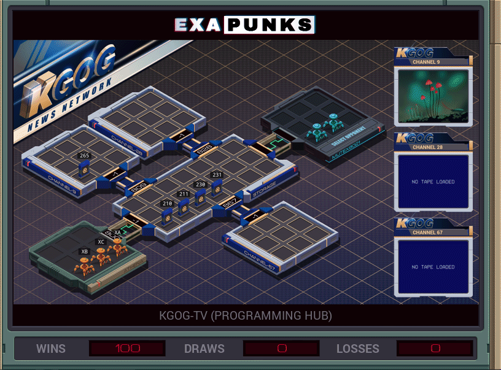

# Default


<details><summary>CODE</summary>
<p>
XA

```
NOTE PLAY 211
LINK 800
GRAB 211
LINK 867
```

XB

```
NOTE HIDE 231
LINK 800
GRAB 231
LINK 809
```

XC

```
NOTE PLAY 210
LINK 800
GRAB 210
LINK 828
DROP
NOTE REMOVE 230
GRAB 230
LINK -1
```
</p>
</details>
